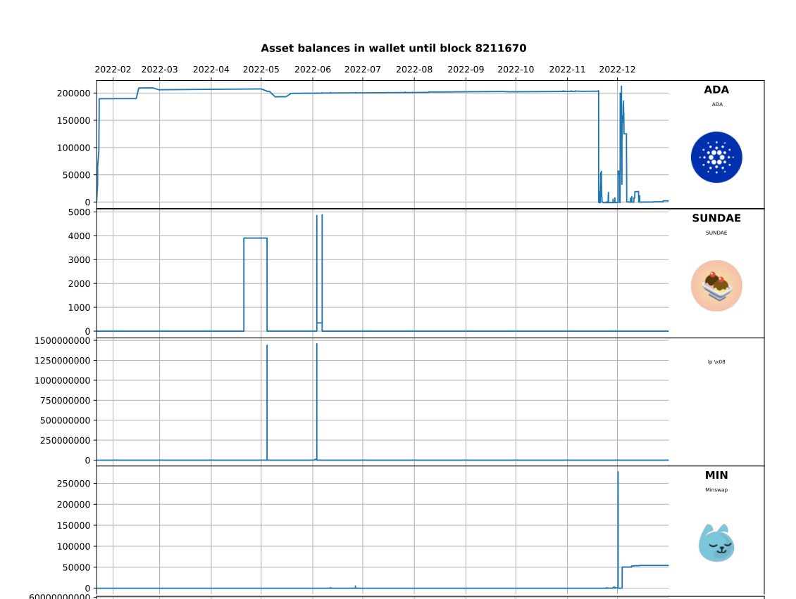

# Cardano Account Pandas Dumper


## Description

Create a spreadsheet with the owned amount of any Cardano asset at the end of a specific block, and a record of the transactions that affected it.

Also, provide a reusable module that lets you turn the transaction history of specified staking addresses into a [Pandas](https://pandas.pydata.org/) dataframe for further analysis and processing.

By default, it will also add synthetic transactions with the staking rewards received at the end of each epoch.

## Requirements

* Python 3.11, possibly works with lower versions, not tested.
* [`pipx`](https://pypa.github.io/pipx/) and `git` (available through your distribution as packages).

## Installation

```sh
pipx install git+https://github.com/pixelsoup42/cardano_account_pandas_dumper
```

Try to run `cardano_account_pandas_dumper -h`. If it fails with `cardano_account_pandas_dumper: command not found`, you need to run `pipx ensurepath` and open a new terminal window to use the tool. If it still doesn't work, you probably need to relogin. This is a one-time setup for all [`pipx`](https://pypa.github.io/pipx/) installs.

## Upgrading

After the first install, run

```sh
pipx upgrade cardano_account_pandas_dumper
```

to get the latest version.

## Basic Usage

The simplest use case is to just run the tool, specifying the CSV output file name and the staking address(es) you are interested in:

```sh
cardano_account_pandas_dumper  --csv_output report.csv <staking_address1> <staking_address2> ...
```

You can then load `report.csv` in your favorite spreadsheet software (eg. Libreoffice Calc or Excel)

If you get a [blockfrost.io](https://blockfrost.io) API error, or if execution is very slow, please see the `blockfrost_project_id` command line flag below.

This basic usage just lists all transactions that affect the specified staking addresses, with the total of each owned asset at the end of the specified `to_block`.

You can also generate graphics output:

```sh
cardano_account_pandas_dumper  --csv_output report.csv --graph_output report.svg <staking_address1> <staking_address2> ...
```

that looks like this:



## Advanced usage

```sh
cardano_account_pandas_dumper --detail_level 2 --csv_output report.csv <staking_address1> <staking_address2> ...
```

With `--detail_level 2`, the tool outputs not only the balance and UTXOs of the owned addresses, but also includes external contracts and addresses.

### Command line flags

`-h`, `--help`
:  show help message and exit

`--blockfrost_project_id BLOCKFROST_PROJECT_ID`
: Blockfrost API key, create your own at <https://blockfrost.io/dashboard>.
This tool comes with its own prepackaged API key that uses the Free plan, so it will be rate limited and capped.
It is likely to be overused and/or abused, so you're better off creating your own.
If you use this tool seriously you're probably better off getting a paid plan.

`--checkpoint_output CHECKPOINT_OUTPUT`
: Path to checkpoint file to create, if any.
This is useful for development, the checkpoint contains all the data fetched from the API so you can tweak the report format without having to call the API on every run, which would be very slow and consume quota.

`--to_block TO_BLOCK`
: Block number to end the search at, if unspecified the tool will look up the latest known block from the API.
For instance, block 8211670 matches EOY 2022 pretty closely.

`--known_file KNOWN_FILE`
: Path to JSONC file with known addresses, scripts, policies, ... See the [packaged file](./src/cardano_account_pandas_dumper/known.jsonc) for an example.

`--from_checkpoint FROM_CHECKPOINT`
: Path to checkpoint file to read, if any.
The checkpoint must have been created with the `--checkpoint_output` flag.

`--xlsx_output XLSX_OUTPUT`
: Path to Excel spreadsheet output file.

`--csv_output CSV_OUTPUT`
: Path to CSV output file.
Specifies the CSV file to write the output to.

`--graph_output CSV_OUTPUT`
: Path to graph output file.
Specifies the graphics file to write.
The format is inferred from the extension, supports all matplotlib formats.

`--graph_order alpha | appearance`
: Graph order of assets: appearance=order of appearance (default), alpha=alphabetical.

`--matplotlib_rc MATPLOTLIB_RC_PATH`
: Path to custom matplotlib defaults file.

`--graph_width WIDTH`
: Width of graph, in inches.

`--graph_height HEIGHT`
: Height of graph for one asset, in inches.

`--width_ratio FLOAT`
: Ratio of plot width to legend with for an asset.

`--detail_level DETAIL_LEVEL`
: Level of detail of report:
1: only break down by own/other addresses  
2: break down other (not own) addresses that are known  
3: same as 2, plus break down own addresses by staking address  
4: same as 3, plus break down own addresses by staking address + spending address

`--unmute`
: Do not mute policies in the mute list and numerical-only metadata.
Some DeFI apps like MinSwap are very spammy, by default some NFTs are muted to keep the output lean.
The muted policies are listed in the `known.jsonc` file. This flag disables muting and shows all assets.

`--raw_values`
: Keep assets, policies and addresses as hex instead of looking up names.

`--truncate_length TRUNCATE_LENGTH`
: Length to truncate numerical identifiers to.
For legibility, policy, address or asset hex values are truncated to a specific number of digits (6 by default).
This flag lets you specify another truncation length.
0 means do not truncate.

`--with_rewards`
: Add synthetic transactions for staking rewards (default=True).

`--with_total`
: Add line with totals for each column at the bottom of the spreadsheet (default=True).

## Output format for CSV and XLSX

### Columns

column 0: transaction timestamp  
column 1: transaction hash  
column 2: transaction message  
columns 3-...: transaction input (positive) or output (negative) for each asset and address.

### Rows

row 0: asset name  
row 1: `own` for own addresses (belonging to the specified staking addresses) and `other` for other addresses.  
row 2: address  
row 3-...:transaction input (positive) or output (negative) for each transaction.

## Possible improvements

* The first obvious possible improvement would be to replace the static `--known_file` that lists the known addresses, policies and scripts with a dynamic API.

The [blockfrost.io](https://blockfrost.io) API already provides some metadata for assets, but AFAIK not for addresses, scripts and policies.

The current list of addresses, scripts and policies was gleaned from external sources like [cardanoscan.io](https://cardanoscan.io) and [cexplorer.io](https://cexplorer.io).

Any suggestion to improve this would be greatly appreciated (please open a GitHub issue).

* If you have other improvements or bug fixes in mind, please open a GitHub issue or send a PR.

However the general philosophy of this tool is to remain as simple as possible, the preferred way to build on top of it is to write other modules that import it, or to consume the data files it produces.

## If you have use for this tool, please consider supporting the toolsmith

Writing good tools takes time, effort and talent. If this tool is useful to you, please consider supporting the toolsmith by donating to

> addr1q84h5zhcvaur9ey8792w0jm5swrcyz8uta9ldnq7h43k2mvu5x99y2s9skjyv82evr0rmjry0een8almmxm5c50kq3lsfuxqc4

(mention "Cardano Account Pandas Dumper" in the message).

or purchasing one of our cool [PixelSoup NFTs](https://www.jpg.store/PixelSoup?tab=listings) !

Donations and NFT purchases are both really appreciated, the advantage of an NFT purchase is that there is a nonzero probability of financial upside.

If you think this tool can be useful to others, please retweet [the announcement](https://twitter.com/PixelSoup42/status/1697305462721396957)
